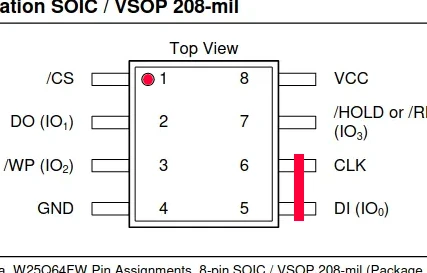
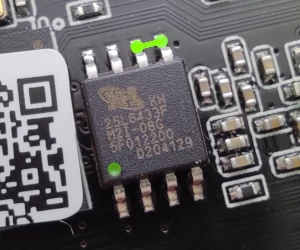

# OpenIPC Wiki
[Table of Content](../index.md)

Frequesntly Asked Questions
---------------------------

### How to get into bootloader shell?

If you can't interrupt the boot sequence with a key combination, or if your
camera requires a bootloader password that you don't know, you can still make
it stop the Linux kernel booting and throw you into the shell.

The first thing to do is locate the flash memory chip on the camera circuit
board. Typically this is a square chip with 8 pins labeled 25Q64 or 25Q128,
rarely 25L64 or 25L128. If you have trouble locating the chip, try taking 
some pictures of your board from both sides. Then ask for help 
[in our Telegram channel](https://t.me/openipc).
__Do not try to short-circuit any random chip! It will most likely burn your camera circuit.__

Short-circuit pins 5 and 6 of the flash chip with a small metal object,
a screwdriver or tweezers, right after the bootloader starts but before it
calls up the Linux kernel.

Pins 5 and 6 of the SOIC8 chip are on the opposite corner of pin 1, indicated
by the embossed or drawn dot next to it.




### How to reset camera settings from U-Boot

Sometimes improper settings make the camera unstable to the point where it is
impossible to log in or not enough time before rebooting to fix the settings.
Here's how to completely erase the overlay partition in the OpenIPC firmware,
right from the bootloader shell, to bring the camera back to its pristine state:

__only for 8MB flash partitioning__
```
sf probe 0; sf erase 0x750000 0xb0000; reset
```
__only for 16MB flash partitioning__
```
sf probe 0; sf erase 0xd50000 0x2b0000; reset
```

### How to sign in into camera via SSH?

`ssh root@<camera_ip_address>`

There is no password by default.

### How to sign in into camera Web UI?

Open http://<camera_ip_address>:85/ and sign in using default username _admin_
and default password _12345_. You will be asked to change the password after
successful login.

__Please note, it will also change your ssh root password!__

### How to reset password for SSH/Web UI?

Create a serial connection to the camera using a UART adapter and a terminal
program. After turning on the camera, press Ctrl-C to interrupt the boot
sequence and enter the bootloader shell.

For a camera with 8MB flash chip, run
```
sf probe; sf erase 0x750000 0xb0000; reset
```
For a camera with 16MB flash chip, run
```
sf probe; sf erase 0xd50000 0x2b0000; reset
```

### How to find information about the camera hardware and software?

Sign in on camera via `ssh` and run `ipctool`.

### I don't see ipctool on camera. Why?

You don't see it because initially it is not there, but there is a shell
command of the same name.

_(Since it's a shell command, it won't work from Web Console in web UI.
Sign in to the camera via SSH and run the command in there.)_

When you run this command, the latest available version of `ipctool` utility
gets downloaded into `/tmp/` directory and runs from there. Since the utility
resides in `/tmp/`, it won't survive a reboot, thus won't take any useful space
on the camera afterwards.

If you need to know what is in the command, search for `ipctool` in the
`/etc/profile` file.

### How to dump full firmware to an NFS share

This could work if you are lucky, you gained access into Linux shell on stock
firmware, and it does support NFS mounting:
```
fw=$(mktemp -t)
nfs=$(dirname $fw)/nfs
mkdir -p $nfs
mount -t nfs -o tcp,nolock 192.168.1.123:/path/to/nfs/share $nfs
cat /dev/mtdblock? > $fw
mv $fw ${nfs}/firmware_full.bin
```
Make sure to use your own IP address and path to the NFS share!

### How to find original MAC address in a firmware dump

```
strings dumpfile.bin | grep ^ethaddr
```

### How to configure ssh session authorization by key

__On the camera__: Sign in into web UI on port 85 of your camera.
```
passwd
```

__On the desktop__: Copy the public key to the camera by logging in with the
password created above.
```
ssh-copy-id root@192.168.1.666
```

__On the camera__: Create a `.ssh` folder in the root user's home directory
and copy the file with the authorized keystore into it.
```
mkdir ~/.ssh
cp /etc/dropbear/authorized_keys ~/.ssh/
```

__On the desktop__: Open a new session to verify that the authorization is
passed using the public key not requesting a password.
```
ssh root@192.168.1.666
```


### Majestic

#### How to get a memory dump for debugging?

Enable and configure Core Dump in the menu Majestic > Majestic Debugging.

#### Camera image has a pink tint

You need to specify GPIO pins to control the infrared filter.
Settings for some cameras can be found in [this table][1].
If your camera is not in the table then you need to use [ipctool utility][2].

The OpenIPC firmware will automatically download the latest version of the
utility to the /tmp directory when `ipctool` is invoked first time.

On stock firmware, you will need to download the utility to the camera yourself
using any tools available in the system: wget, curl, tftp etc.

For example, download the ipctool utility to TFTP server on the local network,
then download it to the camera:
```
tftp -g -r ipctool -l /tmp/ipctool 192.168.1.1
chmod +x /tmp/ipctool
/tmp/ipctool

```

If the camera has access to the internet, you can try to mount a public NFS
sharing and run the utility from it, without downloading to the camera:
```
mkdir -p /tmp/utils
mount -o nolock 95.217.179.189:/srv/ro /tmp/utils/
/tmp/utils/ipctool
```

After the utility is downloaded to the camera, run the `ipctool gpio scan`
command in the terminal and open-close the camera lens a couple of times with
your palm.

Watch the output of ipctool to determine the pins responsible for controlling
the IR filter curtain.

Enter the values obtained in the settings for the night mode Majestic. If the
pink tint still persists, you may need to enable sensor signal inversion.

Don't forget to add the camera model and found GPIO values to the table!

#### Is it possible to display the data for setting the auto focus of lenses
instead of the current sample_af in the standard /metrics?

No, this is a difficult algorithm, it does not have a sense to run it this way.

#### Copy files from Linux system to camera

Sometimes you need to transfer files to the camera. In addition to the above
method using NFS (Network File System) you can use the standard Linux `scp`
command to copy files over an SSH connection:
```
scp ~/myfile root@192.168.1.65:/tmp/
```
This command will copy `myfile` from the home directory to the `/tmp/`
directory on the camera.

On recent Linux systems the following error may occur:
```
sh: /usr/libexec/sftp-server: not found
scp: Connection closed
```
In this case, add `-O` option to the command:
```
scp -O ~/myfile root@192.168.1.65:/tmp/
```


[1]: https://openipc.org/wiki/en/gpio-settings.html
[2]: https://github.com/OpenIPC/ipctool/releases/download/latest/ipctool
